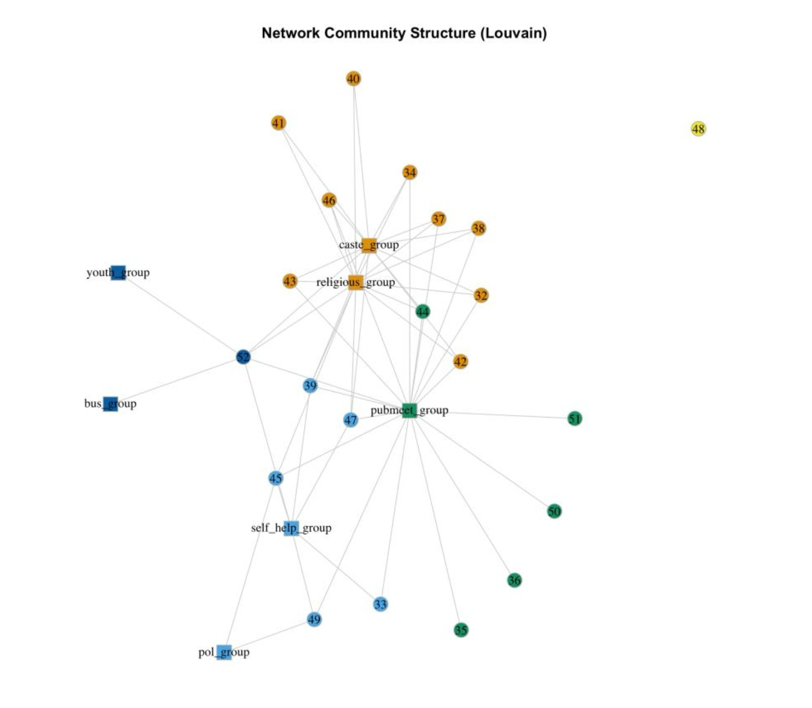

# Empowering Village Voices: Mapping the Social Network of Villagers in India that influences their Political Participation**

**By Nishita Karun & Harsh Vardhan Pachisia**

May 2024

## Abstract
This paper explores the intricate dynamics of social networks and their influence on political participation in rural India. Through a detailed analysis of village-level social networks inMaharashtra and Kerala, the study aims to identify how social capital—rooted in caste, religion, and institutional affiliations—affects political engagement. Using the India Human Development Survey (IHDS) data, we constructed networks to map household connections to various formal institutions, such as cooperatives, self-help groups, and public meetings. The findings reveal significant disparities in network structures and centrality measures between the two villages, highlighting the crucial role of social integration and community institutions in fostering civic participation. In the village in Maharashtra, the network exhibited lower density and fewer active institutions, indicating limited community engagement, with centrality measures pointing to a concentration of influence among specific caste groups. In contrast, Kerala's village displayed a more interconnected and denser network, with public meeting groups serving as central hubs for community interaction. This higher level of integration was associated with increased political participation, particularly among diverse social groups. The study underscores the importance of enhancing network density and inclusivity to improve civic engagement and ensure equitable
political representation in rural India.

### Data

The network dataset was constructuced using a survey dataset. We use survey data from the India Human Development Survey (IHDS). In particular, we use IHDS II,conducted in 2011-12. 

### Methods

All analysis was done in R with data cleaning done using `tidyverse` and network creation, analysis, and visualization done using the `sna` and `igraph` packages. An example of techniques utlizied is showcased below by the social network structure of a village in Kerala (under the Louvain method). 

### Next Steps
Scale the analysis beyond two villages to include all villages in India to better understand how social networks influence their political participation. 